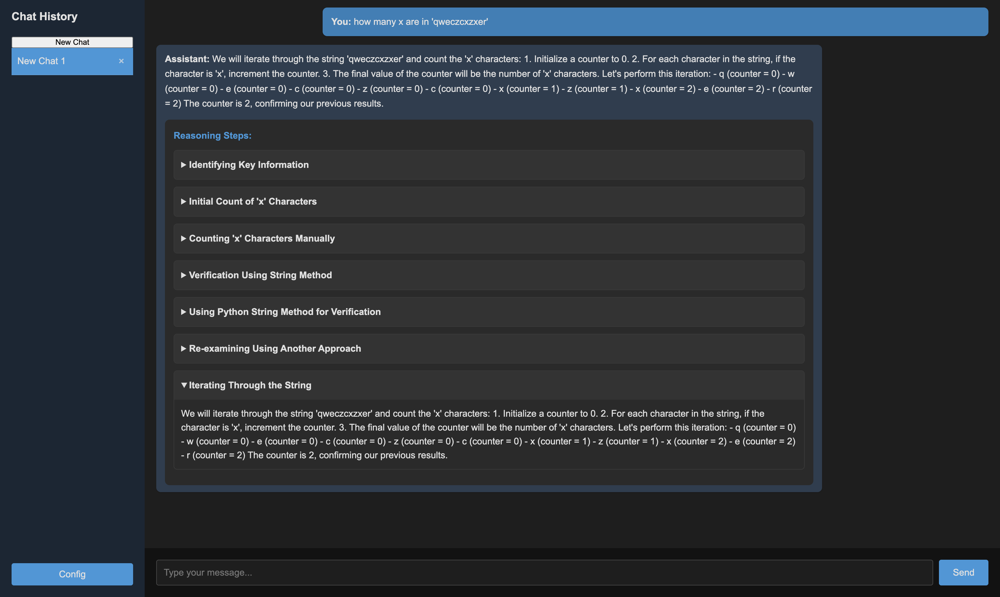

# x1: Enhanced LLM Reasoning Interface



x1 is a lightweight, user-friendly interface for interacting with Large Language Models (LLMs), inspired by the g1 project. It focuses on improving LLM reasoning capabilities through visualized reasoning chains.

## Description

x1 is designed to enhance the reasoning abilities of LLMs by implementing a dynamic Chain-of-Thought approach. It provides a clean, straightforward chat experience while offering powerful features to explore and improve LLM reasoning processes.

## Features

- Clean, minimalist UI for focused interactions
- Real-time chat interface with step-by-step reasoning display
- Support for multiple LLM providers (OpenAI, Groq, Gemini, and custom providers)
- Dynamic reasoning chains to improve LLM problem-solving capabilities
- Ability to switch between different LLM models
- Multiple chat management for comparing different reasoning approaches
- Responsive design for desktop and mobile use

## Inspired by g1

x1 is inspired by the g1 project, which demonstrates the potential of prompting strategies to improve LLM reasoning. Like g1, x1 aims to:

- Create reasoning chains that allow LLMs to "think" and solve logical problems
- Visualize each step of the reasoning process
- Encourage the LLM to explore alternative answers and use multiple methods to derive solutions
- Help overcome common LLM logic issues through dynamic reasoning

## Technologies Used

- React 18.3
- TypeScript
- Vite 5.4
- Axios for API requests

## Installation

1. Clone the repository:
   ```
   git clone https://github.com/lout33/x1.git
   cd x1
   ```

2. Install dependencies:
   ```
   npm install
   ```

3. Set up your API keys (see API Configuration section below)

## Usage

To run the development server:

```
npm run dev
```

To build for production:

```
npm run build
```

To preview the production build:

```
npm run preview
```

## API Configuration

To use this application, you need to set up API keys for the LLM providers you want to use:

1. Obtain API keys from the following providers (as needed):
   - [OpenAI](https://openai.com/)
   - [Groq](https://www.groq.com/)
   - [Google AI Studio (for Gemini)](https://makersuite.google.com/)

2. In the application, click on the "Config" button in the sidebar.

3. Select the LLM provider you want to use and enter the corresponding API key.

4. For custom providers, enter the base URL and API key as required.

**Note:** The application stores API keys in the browser's local storage. Never share your API keys or expose them publicly.

## Contributing

Contributions are welcome! Please feel free to submit a Pull Request.

1. Fork the repository
2. Create your feature branch (`git checkout -b feature/AmazingFeature`)
3. Commit your changes (`git commit -m 'Add some AmazingFeature'`)
4. Push to the branch (`git push origin feature/AmazingFeature`)
5. Open a Pull Request

## License

This project is open source and available under the [MIT License](LICENSE).

---

This project was bootstrapped with Vite. For more information on using Vite, refer to the [Vite documentation](https://vitejs.dev/).
